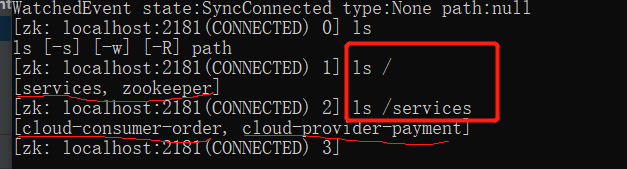

#### eureka集群，互相注册，相互守望
##### 需要在RestTemplate配置类中加上 @LoadBalanced注解，不然不知道找哪个服务，报错
-  `http://localhost:8001/actuator/health`浏览器中输入这个查看服务的状态
### zookeeper注册
#### win10 docker安装zookeeper
`进入cmd，docker search zookeeper，
 docker pull zookeeper 默认下载最新，
 docker run -p 2181:2181 --name zookeeper zookeeper 启动容器
 docker exec -it 容器id /bin/bash
 ./zkCli.sh 启动客户端
 ls / 查看节点
 当服务注册成功时

`
- 当一段时候内收不到心跳是，不会马上剔除服务，隔一段时候收不到心跳，则剔除，临时结点

###三个注册中心的异同
- C:Consistency(强一致性)
- A:Availability(可用性)
- P:Partition tolerance(分区容错性)
- 分布式，P一定要保证

|组件名|语言|CAP|服务健康检查|对外暴露接口|spring集成|
|:----:|:----:|:----:|:----:|:----:|:----:|
|eureka|java|ap|可配支持|http|已集成|
|consul|go|cp|支持|http/dns|已集成|
|zookeeper|java|cp|支持|客户端|已集成|

nacos支持ap，cp。可以切换
`cur -X PUT $NACOS_SERVER:8848/nacos/v1/ns/operator/switches?entry=serverMode&value=CP`

#### openfeign设置超时配置
`
 当服务端有耗时接口时，需要设置这个
 设置feign客户端的超时时间，openfeign默认支持ribbon
ribbon:
指的是建立连接所用的时间，适用于网络状况正常的情况下，两端连接所用的时间
ReadTimeout: 5000
指连接建立成功后，从服务器读取到可用资源所用时间
ConnectTimeout: 5000
`

######日志配置类
- NONE:默认的，不显示任何日志
- BASIC:仅记录请求方法，URL,响应状态码及执行时间
- HEADERS:除了BASIC中定义的信息外，还有请求和响应关的信息
- FULL:除了HEADERS中定义的信息之外，还有请求和响应正文及元数据

```
@Configuration
public class FeignConfig {
@Bean
public Logger.Level feignLoggerLevel() {
return Logger.Level.FULL;
}
}
```

####Hystrix
######重要三点
- 服务降级 fallback
- 服务熔断 break
- 服务限流 flowlimit
- 接近实时的监控
### Hystrix中@HystrixCommand不指定fallback时，如果配置了全局fallback就走全局的
`@DefaultProperties(defaultFallback = "payment_Global_FallbackMethod")`
#### 服务熔断
### 熔断机制是应对雪崩效应的一种微服务链路保护机制

----
#### Linux中nacos集群配置
```
一个nacos：直接启动在8848端口startup.sh,并配置数据库相关的信息。单机应该修改startup.sh中的启动模式为"standalone" 
三个nacos: 3333,4444,5555启动时，加-p参数，设置端口
  修改各自目录下的cluster.conf
     xxx.xxx.xxx.xxx:3333
     xxx.xxx.xxx.xxx:4444
     xxx.xxx.xxx.xxx:5555
  注意：xxx.xxx.xxx.xxx不能是127.0.0.1，要hostname -i命令能够识别的
  
修改nacos启动脚本：startup.sh
中的while部分
下面这里修改之后，老版本可能只是":m:f:s",并且后面的没有对应的case
while getopts ":m:f:s:c:p:" opt
do
    case $opt in
        m)
            MODE=$OPTARG;;
        f)
            FUNCTION_MODE=$OPTARG;;
        s)
            SERVER=$OPTARG;;
        c)
            MEMBER_LIST=$OPTARG;;
        p)
            EMBEDDED_STORAGE=$OPTARG;;
        ?)
        echo "Unknown parameter"
        exit 1;;
    esac
done
如果上面修改后，没有作用，再修改(修改前) nohup $JAVA ${JAVA_OPT} nacos.nacos >> ${BASE_DIR}/logs/start.out 2>&1 &
修改后：
nohup $JAVA -Dserver.port=${PORT} ${JAVA_OPT} nacos.nacos >> ${BASE_DIR}/logs/start.out 2>&1 &
最后，启动方式：./startup.sh -p 3333;./startup.sh -p 4444;./startup.sh -p 5555
```